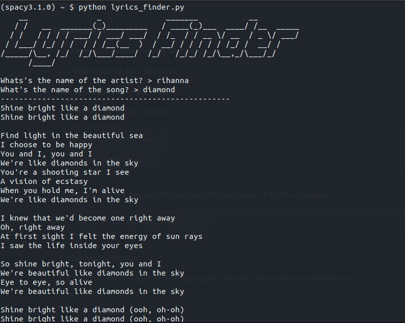

# Song Lyrics Finder

**TODO**

Leverage Musixmatch API to create an interactive CLI app that allows the user to key in
a search query of a song.

If the song is found on [Musixmatch](https://developer.musixmatch.com/documentation) database, please display
the lyrics to the user.

Give the user a menu where they can choose to search or view saved song lyrics.

You can ask a user whether they want to save their search results. If so, store the lyrics
in a local SQLite database.

# How to use the CLI app

### Prerequisites

* [Python3](http://www.python.org/downloads)
* [Musixmatch Developer Account](https://developer.musixmatch.com/)

### Installation

1. Download or clone the repository

2. Install requests from terminal

3. Install sqlite3 from terminal

4. Install pandas from terminal

    
        pip3 install -r requirements.txt

3. Create a file api_key.py and pass you  API key inside of the file as below:

        api_key = "&apikey=YOUR_API_KEY"        

4. Run lyrics_finder.py

5. Lastly run the check_database_data.py to view the lyrics table as a Dataframe.

### How  the CLI app  will look like

*Fig: Displaying Diamond lyrics, a song by Rihanna.*