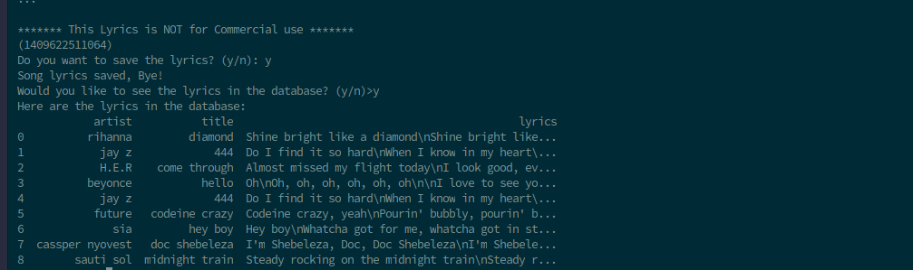

# Song Lyrics Finder

**TODO**

Leverage Musixmatch API to create an interactive CLI app that allows the user to key in
a search query of a song.

If the song is found on [Musixmatch](https://developer.musixmatch.com/documentation) database, please display
the lyrics to the user.

Give the user a menu where they can choose to search or view saved song lyrics.

You can ask a user whether they want to save their search results. If so, store the lyrics
in a local SQLite database.

# How to use the CLI app

### Prerequisites

* [Python3](http://www.python.org/downloads)
* [Musixmatch Developer Account](https://developer.musixmatch.com/)

### Installation

1. Download or clone the repository

2. Install requirements

        pip3 install -r requirements.txt

Create a .env file and pass your  API key inside of the file as below:

        api_key = "&apikey=YOUR_API_KEY"

 base url

        base_url = "https://api.musixmatch.com/ws/1.1/"

api method for getting lyrics

        lyrics_matcher = "matcher.lyrics.get"

format url

        format_url = "?format=json&callback=callback"

parameters

        artist_search = "&q_artist="

        song_search = "&q_track="

4. Run

        python lyrics_finder.py

You will be prompted with a  menu of options to choose how you would like to proceed.

### How  the CLI app  will look like

*Fig: Displaying 'midnight train' lyrics, a song by Sauti Sol Band.*

*Fig: Displaying lyrics in database table*
